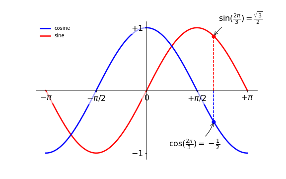
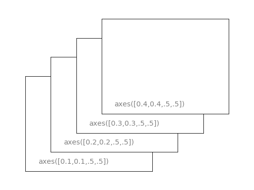

<sub>Title: Python 学习日记 - Python绘图基础 - Matplotlib<br>Author:<a href="https://github.com/Alpaka1017?tab=repositories" target="_blank">Xueyong Lu  <i class="fa fa-github" aria-hidden="true"></i></a></br><small>First Edition: March - 2023</small></sub>

<div align = "center">
    <h1>
        Python 学习日记 - Part 07
    </h1>
</div>
<div align = "right">
    <h2>Python绘图基础 - Matplotlib</h2>
</div>


📘<<[Part 06](./Python_Part_06-Class_Object.md) | [Part 08](./Python_Part_08-MagicFunc.md)]>> 

## 1. 2-D数据可视化

* **`pylab：`**

  * Matplotlib和Numpy两个库的结合体，提供了Matlab风格的接口和一些额外的便利功能

  * 可以直接使用Matlab中的一些函数和变量，如`plot`、`subplot`、`title`、`xlabel`、`ylabel`等等。此外，`pylab`模块也包括了Matplotlib和Numpy的大部分常用函数和变量，例如`array`、`zeros`、`ones`、`linspace`、`pi`等等

  * &#x2139;**`注意：`**使用`pylab`模块会导入很多变量和函数，这会导致命名空间污染和函数名冲突的问题 &#x2192; 适合交互环境下使用

    ```python
    # 导入Matplotlib中的所有模块，包括numpy、matplotlib、pylab等
    from pylab import * 
    ```

* **`pyplot：`**

  * 只导了Matplotlib库中的`pyplot`模块，这个模块包含了绘图的核心函数和类，包括`plot`、`scatter`、`hist`、`bar`等等

  * 导入时需要使用命名空间访问其中的函数和变量

    ```python
    import matplotlib.pyplot as plt
    ```

* **`matplotlib：`**

  * 导入Matplotlib库本身，包括`pyplot`、`animation`、`cm`、`patches`等等

    ```python
    import matplotlib as plt
    ```

### 1.1 绘制基本图形

#### 1.1.1 基本函数绘制

```python
import numpy as np
import matplotlib.pyplot as plt

X = np.linspace(-np.pi, np.pi, 256, endpoint=True)	# endpoint = True, 意味着为一闭区间，否则将不会包括最后一个采样点
C,S = np.cos(X), np.sin(X)

plt.plot(X,C)
plt.plot(X,S)

plt.show()
```


* **`fig, ax = plt.subplots():`**
  * 创建了一个 `Figure` 对象和一个 `Axes` 对象，并将这两个对象返回给变量 `fig` 和 `ax`
  * `Figure` 对象代表整个图形，而 `Axes` 对象代表具体的绘图区域
  *  `ax` 来绘制具体的图形，比如通过调用 `ax.plot()` 或 `ax.scatter()` 方法。`fig` 对象可以用来设置整个图形的属性，比如大小和标题

#### 1.1.2 线型设置

```python
...
# 绘图窗口大小：10x6 英寸，分辨率80
figure(figsize=(10,6), dpi=80)
plot(X, C, color="blue", linewidth=2.5, linestyle="-")
plot(X, S, color="red",  linewidth=2.5, linestyle="-")
...
```

* **颜色：**Matplotlib库中，图形颜色支持以下方式定义：

  * 英文单词/ 缩写：`color='__'`

    |  `b`   |   `g`   |  `r`  |  `c`   |    `m`    |   `y`    |   `k`   |   `w`   |
    | :----: | :-----: | :---: | :----: | :-------: | :------: | :-----: | :-----: |
    |  蓝色  |  绿色   | 红色  |  青色  |   品红    |   黄色   |  黑色   |  白色   |
    | `blue` | `green` | `red` | `cyan` | `magenta` | `yellow` | `black` | `white` |

  * HTML十六进制颜色：`color='#008000'`

  * RGBA颜色：`color=(0.5, 0.5, 0.5, 1)` &#x2192; 分别对应RGB的三个值和透明度

  * [RGB-16进制颜色转换工具](https://www.sioe.cn/yingyong/yanse-rgb-16/)

* **线型：**`linestyle=‘__’`

  |  **-**  | **- -**  |  **:**   |  **-.**   |
  | :-----: | :------: | :------: | :-------: |
  |  实线   |   虚线   |   点线   |  点划线   |
  | `solid` | `dashed` | `dotted` | `dashdot` |

* **线宽：**`linewidth=2.5`(px)

#### 1.1.3 坐标轴设置

* **设置坐标轴范围**

  ```python
  xmin ,xmax = X.min(), X.max()
  ymin, ymax = Y.min(), Y.max()
  
  dx = (xmax - xmin) * 0.2
  dy = (ymax - ymin) * 0.2
  
  plt.xlim(xmin - dx, xmax + dx)
  plt.ylim(ymin - dy, ymax + dy)
  ```

* **设置坐标轴刻度**

  * **`xticks, yticks`**：指定刻度的标签和属性的方法，如刻度标签的文本、大小、颜色等属性

    ```python
    ···
    xticks( [-np.pi, -np.pi/2, 0, np.pi/2, np.pi] )
    yticks( [-1, 0, +1] )
    ...
    ```

  * **Tick Locators**：指定刻度的位置，是`matplotlib`库内部使用的类，需要调用相应的`Locator`子类进行实例化

    ```python
    import matplotlib.pyplot as plt
    import matplotlib.ticker as ticker
    import numpy as np
    
    fig, ax = plt.subplots()
    x = np.arange(0, 10, 0.1)
    y = np.sin(x)
    
    ax.plot(x, y)
    
    # 设置 x 轴的 tick locator
    ax.xaxis.set_major_locator(ticker.MultipleLocator(1.0))
    ax.xaxis.set_minor_locator(ticker.MultipleLocator(0.5))
    
    plt.show()
    ```

    

* **设置坐标轴标签**

  ```python
  ...
  xticks( [-np.pi, -np.pi/2, 0, np.pi/2, np.pi],
          [r'$-\pi$', r'$-\pi/2$', r'$0$', r'$+\pi/2$', r'$+\pi$'] )
  
  yticks( [-1, 0, +1],
          [r'$-1$', r'$0$', r'$+1$'] )
  ...
  ```

  

* **脊柱平移**

  * 脊柱：坐标轴和上面的记号**Splines**

  ```python
  import numpy as np
  import matplotlib.pyplot as plt
  
  ...
  ax = gca()
  
  # 将脊柱放在图的中间
  ax.spines['right'].set_color('none')          # 右脊柱设置为无色
  ax.spines['top'].set_color('none')			  # 上脊柱设置为无色
  ax.spines['bottom'].set_position(('data',0))  # 下脊柱调整到数据空间的'0'点
  ax.spines['left'].set_position(('data',0))	  # 上脊柱调整到数据空间的'0'点
  
  ax.xaxis.set_ticks_position('bottom')
  ax.yaxis.set_ticks_position('left')
  ...
  ```

  

* **添加图例**

  ```python
  ...
  plot(X, C, color="blue", linewidth=2.5, linestyle="-", label="cosine")
  plot(X, S, color="red",  linewidth=2.5, linestyle="-", label="sine")
  
  plt.legend(loc='upper left')
  ...
  ```

  |    右上     |    左上    |    左下    |    右下     | 正右  |  中央偏左   |   中央偏右   |   中央偏下   |   中央偏下   | 正中央 |
  | :---------: | :--------: | :--------: | :---------: | :---: | :---------: | :----------: | :----------: | :----------: | :----: |
  | upper right | upper left | lower left | lower right | right | center left | center right | lower center | upper center | center |
  |      1      |     2      |     3      |      4      |   5   |      6      |      7       |      8       |      9       |   10   |

  * 格式：**`plt.legend(loc='upper right')`**或者**`plt.legend(loc=1)`**

* **数据点标注**

  * `scatter(...)`
    * 绘制单个点：`[x, ]`, `[y, ]`，或者`[, x]`, `[, y]`
    * 绘制线段：`[x1, x2]`, `[y1, y2]`
    * 绘制散点图：`[x1, x2, x3, ...]`, `[y1, y2, y3, ...]`

  * `annotate(...)`

    * `r'$...$'`：注释的文本，其中 $符号表示支持 LaTeX 格式的公式渲染
    * `xy=(, )`：注释箭头所指向的点的坐标
    * `xycoords='data'`：指定 xy 坐标系的类型，这里表示使用数据坐标系
    * ` xytext=(+10, +30)`：注释文本的坐标相对于点的坐标的偏移量
    * `textcoords='offset points'`：指定 xytext 坐标系的类型，这里表示使用偏移坐标系
    * `fontsize=16`：注释文本字体大小
    * `arrowprops=dict(arrowstyle="->", connectionstyle="arc3,rad=.2")`：注释箭头的样式设置，包括箭头形状和连接线样式

    ```python
    ···
    # 绘制虚线段（垂直）
    plot([t,t],[0,np.cos(t)], color ='blue', linewidth=2.5, linestyle="--")
    
    # 坐标(t, cos(t))，点的大小为50pt
    scatter([t,],[np.cos(t),], 50, color ='blue')
    
    # 数据标签
    annotate(r'$支持Latex格式公式}$',
             xy=(t, np.sin(t)), xycoords='data',
             xytext=(+10, +30), textcoords='offset points', fontsize=16,
             arrowprops=dict(arrowstyle="->", connectionstyle="arc3,rad=.2"))
    ···
    ```

* **其它优化：阻挡元素变透明**

  ```python
  ...
  for label in ax.get_xticklabels() + ax.get_yticklabels():
      label.set_fontsize(16)
      label.set_bbox(dict(facecolor='white', edgecolor='None', alpha=0.65 ))
  ...
  ```

  * 使被图像挡住的坐标轴标签加一个背景，参数中有填充颜色、边界颜色和透明度可调

    

#### 1.1.4 图像和子图

* **图像**：以==[Figure #]==为标题的那些窗口。图像编号从 **1** 开始，与 MATLAB 的风格一致

  | 参数        | 默认值             | 描述                 |
  | ----------- | ------------------ | -------------------- |
  | `num`       | `1`                | 图像的数量           |
  | `figsize`   | `figure.figsize`   | 图像的长和宽（英寸） |
  | `dpi`       | `figure.dpi`       | 分辨率（点/英寸）    |
  | `facecolor` | `figure.facecolor` | 绘图区的背景颜色     |
  | `edgecolor` | `figure.edgecolor` | 绘图区的边缘颜色     |
  | `frameon`   | `True`             | 是否绘制图像边缘     |

* **子图**

  * **`subplot(m,n,i)`**：参考Matlab语法

  * **`gridspec`**：`import matplotlib.gridspec as gridspec`

    ```python
    from pylab import *		    # 交互环境，未指明命名空间
    import matplotlib.gridspec as gridspec
    
    G = gridspec.GridSpec(3, 3) # 创建一个3行3列的网格，即总共9个子图
    
    axes_1 = subplot(G[0, :])   # 第一行的所有列
    xticks([]), yticks([])
    text(0.5,0.5, 'Axes 1',ha='center',va='center',size=24,alpha=.5)
    
    axes_2 = subplot(G[1,:-1])  # 第二行的第1列到第2列, G[1, 0:2]
    xticks([]), yticks([])
    text(0.5,0.5, 'Axes 2',ha='center',va='center',size=24,alpha=.5)
    
    axes_3 = subplot(G[1:, -1]) # 第二行的最后一列和第三行, G[1:, 2]
    xticks([]), yticks([])
    text(0.5,0.5, 'Axes 3',ha='center',va='center',size=24,alpha=.5)
    
    axes_4 = subplot(G[-1,0])   # 最后一行的第1列, G[2, 0]
    xticks([]), yticks([])
    text(0.5,0.5, 'Axes 4',ha='center',va='center',size=24,alpha=.5)
    
    axes_5 = subplot(G[-1,-2])  # 最后一行的第2列, G[2, 1]
    xticks([]), yticks([])
    text(0.5,0.5, 'Axes 5',ha='center',va='center',size=24,alpha=.5)
    
    #plt.savefig('../figures/gridspec.png', dpi=64)
    show()
    ```

    

* **坐标轴**

  * 将子图放在任意位置

    ```python
    from pylab import *
    
    # 左下角(0.1, 0.1)， 高度,宽度=0.5,0.5 的子图
    axes([0.1, 0.1, .5, .5])
    # x,y刻度为空
    xticks([]), yticks([])
    # (0.1, 0.1)处放置文本框，ha:水平左对齐，va:垂直居中
    text(0.1, 0.1, 'axes([0.1,0.1,0.5,0.5])', ha='left', va='center', size=16, alpha=.5)
    
    axes([0.2, 0.2, .5, .5])
    xticks([]), yticks([])
    text(0.1, 0.1, 'axes([0.2,0.2,.5,.5])', ha='left', va='center', size=16, alpha=.5)
    
    axes([0.3, 0.3, .5, .5])
    xticks([]), yticks([])
    text(0.1, 0.1, 'axes([0.3,0.3,.5,.5])', ha='left', va='center', size=16, alpha=.5)
    
    axes([0.4, 0.4, .5, .5])
    xticks([]), yticks([])
    text(0.1, 0.1, 'axes([0.4,0.4,.5,.5])', ha='left', va='center', size=16, alpha=.5)
    
    # plt.savefig("../figures/axes-2.png",dpi=64)
    show()
    ```

    

#### 1.1.5 循环绘制多张子图

* 用==**enumerate()**==函数获得当前迭代的索引`i`和变量`arr`

* 用`axs[i]`访问每一个子图

* 用`imshow()`方法显示数组`arr`

  ```python
  fig, axs = plt.subplots(1, 3, figsize=(12, 3.5))
  for i, arr in enumerate([a, b, c]):
      axs[i].imshow(np.array(arr).reshape(5,6),cmap='plasma')
  plt.show()
  ```

#### 1.1.6 示例：

* **图像填充**

  ```python
  from pylab import *
  
  n = 256
  X = np.linspace(-np.pi, np.pi, n, endpoint=True)
  Y1 = 6 * np.sin(np.pi * X)
  Y2 = 2 * np.cos(np.pi * X) + 5 * np.cos(5 * np.pi * X)
  
  plt.axes([0.025, 0.025, 0.95, 0.95])
  
  plt.plot(X, Y2, color='blue', alpha=1.00)
  plt.fill_between(X, Y1, Y2, Y2 > Y1, color='blue', alpha=.25)
  plt.fill_between(X, Y1, Y2, Y2 < Y1, color='red', alpha=.25)
  ```

  

* **散点图**

  ```python
  import numpy as np
  import matplotlib.pyplot as plt
  
  n = 1024
  X = np.random.normal(0, 1, n)
  Y = np.random.normal(0, 1, n)
  T = np.arctan2(Y, X)
  
  plt.axes([0.025, 0.025, 0.95, 0.95])
  plt.scatter(X, Y, s=75, c=T, cmap='gist_heat', alpha=.5)
  
  # plt.scatter(X, Y, s=散点大小，c=散点颜色, alpha=透明度)
  # 通过arctan2函数将(X,Y)数组转换为(0~2pi)的角度值
  # 将角度值用颜色映射函数映射到颜色上
  ```

  * &#x2139;**注意：**`plt.axes`也会打开一个画布（Figure）

    

  * `cmap='__'`为要映射到的 [Color bar of Matplotlib](https://i.328888.xyz/2023/03/28/inhq8E.png)

## 2. 3-D数据可视化

### 2.1 **等高图 (Equivalent)**

```python
def f(x, y):
    return (1 - x / 2 + x ** 5 + y ** 3) * np.exp(-x ** 2 - y ** 2) # x^5 = x**5

def contour_ex():
    n = 256
    x = np.linspace(-3, 3, n)
    y = np.linspace(-3, 3, n)
    X, Y = np.meshgrid(x, y)

    plt.axes([0.025, 0.025, 0.95, 0.95])
	
    # 8个等高线级别，透明度0.75，色条：热度图
    plt.contourf(X, Y, f(X, Y), 8, alpha=.75, cmap=plt.cm.hot)
    # 设置等高线颜色，线宽
    C = plt.contour(X, Y, f(X, Y), 8, colors='black', linewidth=.5)
    # 添加等高线标签，在等高线内部
    plt.clabel(C, inline=1, fontsize=10)

    plt.xticks([]), plt.yticks([])
    # savefig('../figures/contour_ex.png',dpi=48)
    plt.show()
```


### 2.2 **3D (Waterfall)**

```python
from mpl_toolkits.mplot3d import Axes3D

fig = plt.figure()
ax = Axes3D(fig)
X = np.arange(-4, 4, 0.25)
Y = np.arange(-4, 4, 0.25)
X, Y = np.meshgrid(X, Y)
R = np.sqrt(X**2 + Y**2)
Z = np.sin(R)

ax.plot_surface(X, Y, Z, rstride=1, cstride=1, cmap=plt.cm.hot)
ax.contourf(X, Y, Z, zdir='z', offset=-2, cmap=plt.cm.hot)
ax.set_zlim(-2,2)

# savefig('../figures/plot3d_ex.png',dpi=48)
plt.show()
```


## 3. 其他图像

### 3.1 **条形图 (Histogram)**

```python
n = 12

X = np.arange(n) # [0 1 2 3 ... 11]等差数组
Y1 = (1 - X / float(n)) * np.random.uniform(0.5, 1.0, n)
Y2 = (1 - X / float(n)) * np.random.uniform(0.5, 1.0, n)

plt.axes([0.025, 0.025, 0.95, 0.95])
plt.bar(X, +Y1,  width=.85, facecolor='#9999ff', edgecolor='white')
plt.bar(X, -Y2,  width=.85, facecolor='#ff9999', edgecolor='white')

for x, y in zip(X, Y1):
    plt.text(x, y + 0.05, '%.2f' % y, ha='center', va='bottom')

for x, y in zip(X, Y2):
    plt.text(x, -y - 0.05, '%.2f' % y, ha='center', va='top')

plt.xlim(-.5, n), plt.xticks([])
plt.ylim(-1.25, +1.25), plt.yticks([])

# savefig('../figures/bar_ex.png', dpi=48)
plt.show()
```


### 3.2 **灰度图 (Gray diagram)**

```python
def f(x, y):
    return (1 - x / 2 + x ** 5 + y ** 3) * np.exp(-x ** 2 - y ** 2) # x^5 = x**5

def imshow_ex():
    n = 10
    x = np.linspace(-3, 3, int(3.5*n))
    y = np.linspace(-3, 3, int(3.0*n))
    X, Y = np.meshgrid(x, y)
    Z = f(X, Y)

    plt.axes([0.025, 0.025, 0.95, 0.95])
    # 插值方式：bicubic，颜色图谱：bone(黑白渐变)，lower:左下角为原点
    plt.imshow(Z, interpolation='bicubic', cmap='bone', origin='lower')
    # 颜色条的长度为原始长度的0.92倍
    plt.colorbar(shrink=.92)

    plt.xticks([]), plt.yticks([])
    # savefig('../figures/imshow_ex.png', dpi=48)
    plt.show()
```


### 3.3 **饼状图 (Pie diagram)**

```python
n = 20
Z = np.ones(n)
Z[-1] *= 2

plt.axes([0.025, 0.025, 0.95, 0.95])

plt.pie(Z, explode=Z * .05, colors=['%f' % (i / float(n)) for i in range(n)],
        wedgeprops={"linewidth": 1, "edgecolor": "black"})

# plt.gca()返回当前axes对象
# set_aspect('equal')设置x和y轴的比例相等，使得图形在两个方向上看起来是等比例的
plt.gca().set_aspect('equal')
plt.xticks([]), plt.yticks([])

# savefig('../figures/pie_ex.png',dpi=48)
plt.show()
```


### 3.4 **量场图 (Quiver plots)**

```python
n = 8										# 整数，用于定义网格大小
X,Y = np.mgrid[0:n,0:n]						# 由np.mgrid生成的网格坐标矩阵
T = np.arctan2(Y-n/2.0, X-n/2.0)			# 计算出的每个网格点的极角（弧度），用于表示每个向量箭头的方向
R = 10+np.sqrt((Y-n/2.0)**2+(X-n/2.0)**2)	# 计算出的每个网格点的极径，用于表示每个向量箭头的长度
U,V = R*np.cos(T), R*np.sin(T)				# 计算出的每个向量箭头的水平和垂直分量

plt.axes([0.025,0.025,0.95,0.95])

# X,Y网格坐标矩阵; U,V向量的水平和垂直分量; R可选参数，用于表示每个向量箭头的长度。如果未指定，则默认为1
plt.quiver(X,Y,U,V,R, alpha=.5)
plt.quiver(X,Y,U,V, edgecolor='k', facecolor='None', linewidth=.5)

plt.xlim(-1,n), plt.xticks([])
plt.ylim(-1,n), plt.yticks([])

# savefig('../figures/quiver_ex.png',dpi=48)
plt.show()
```


### 3.5 **网格 (Grid)**

```python
ax = plt.axes([0.025, 0.025, 0.95, 0.95])

ax.set_xlim(0, 4)
ax.set_ylim(0, 3)
# Tick Locator
ax.xaxis.set_major_locator(plt.MultipleLocator(1.0))
ax.xaxis.set_minor_locator(plt.MultipleLocator(0.1))
ax.yaxis.set_major_locator(plt.MultipleLocator(1.0))
ax.yaxis.set_minor_locator(plt.MultipleLocator(0.1))

ax.grid(which='major', axis='x', linewidth=0.75, linestyle='-', color='0.75')
ax.grid(which='minor', axis='x', linewidth=0.25, linestyle='-', color='0.75')
ax.grid(which='major', axis='y', linewidth=0.75, linestyle='-', color='0.75')
ax.grid(which='minor', axis='y', linewidth=0.25, linestyle='-', color='0.75')

ax.set_xticklabels([])
ax.set_yticklabels([])

# savefig('../figures/grid_ex.png',dpi=48)
plt.show()
```


### 3.6 **极轴图 (Polar axis diagram)**

```python
ax = plt.axes([0.025,0.025,0.95,0.95], polar=True)

N = 20
# 等差数列
theta = np.arange(0.0, 2*np.pi, 2*np.pi/N)
radii = 10*np.random.rand(N)
width = np.pi/4*np.random.rand(N)
bars = plt.bar(theta, radii, width=width, bottom=0.0)

for r,bar in zip(radii, bars):
    bar.set_facecolor( plt.cm.jet(r/10.))
    bar.set_alpha(0.5)

ax.set_xticklabels([])
ax.set_yticklabels([])
# savefig('../figures/polar_ex.png',dpi=48)
plt.show()
```


### 3.7 **手稿图 (Manuscript)**

```python
eqs = []
    eqs.append((
                   r"$W^{3\beta}_{\delta_1 \rho_1 \sigma_2} = U^{3\beta}_{\delta_1 \rho_1} + \frac{1}{8 \pi 2} \int^{\alpha_2}_{\alpha_2} d \alpha^\prime_2 \left[\frac{ U^{2\beta}_{\delta_1 \rho_1} - \alpha^\prime_2U^{1\beta}_{\rho_1 \sigma_2} }{U^{0\beta}_{\rho_1 \sigma_2}}\right]$"))
    eqs.append(
        (r"$\frac{d\rho}{d t} + \rho \vec{v}\cdot\nabla\vec{v} = -\nabla p + \mu\nabla^2 \vec{v} + \rho \vec{g}$"))
    eqs.append((r"$\int_{-\infty}^\infty e^{-x^2}dx=\sqrt{\pi}$"))
    eqs.append((r"$E = mc^2 = \sqrt{{m_0}^2c^4 + p^2c^2}$"))
    eqs.append((r"$F_G = G\frac{m_1m_2}{r^2}$"))

    plt.axes([0.025, 0.025, 0.95, 0.95])

    for i in range(24):
        index = np.random.randint(0, len(eqs))
        eq = eqs[index]
        size = np.random.uniform(12, 32)
        x, y = np.random.uniform(0, 1, 2)
        alpha = np.random.uniform(0.25, .75)
        plt.text(x, y, eq, ha='center', va='center', color="#11557c", alpha=alpha,
                 transform=plt.gca().transAxes, fontsize=size, clip_on=True)

    plt.xticks([]), plt.yticks([])
    # savefig('../figures/text_ex.png',dpi=48)
    plt.show()
```


📘<<[Part 06](./Python_Part_06-Class_Object.md) | [Part 08](./Python_Part_08-MagicFunc.md)]>> 
